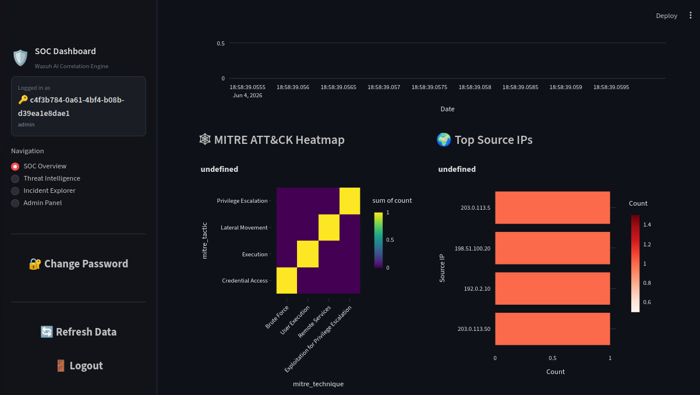
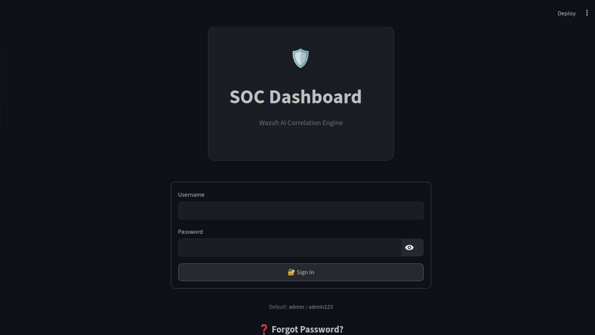

# Wazuh AI Correlation Engine

AI-powered security incident correlation and response platform for Wazuh SIEM. Ingests Wazuh alerts from multiple sources (local files, Wazuh API, Wazuh Indexer, Elasticsearch, Kafka), correlates them into incidents, enriches with threat intelligence, assigns risk scores, and provides AI-driven analysis via a FastAPI backend and Streamlit SOC dashboard.

## Features

- **Alert Ingestion** — Local files, Wazuh REST API v2, Wazuh Indexer (OpenSearch), Elasticsearch, and Kafka. Pydantic validation, normalization, dead-letter queue, configurable batching, and automatic retry with exponential backoff
- **Correlation Engine** — 6 pluggable rule types (time-based, asset-based, user-based, network-based, rule-based, semantic-based) using ML embeddings for similarity grouping. Automated false-positive tracking with dynamic rule weight adjustment
- **Deduplication** — SHA-256 fingerprint-based dedup across configurable time windows with O(1) lookup
- **Threat Intelligence** — AbuseIPDB, VirusTotal, GeoIP, and ASN enrichment providers with TTL caching and graceful degradation
- **Risk Scoring** — Multi-factor scoring (rule severity, asset criticality, threat intel confidence, recency, correlation count) with historical baseline normalization. MITRE ATT&CK technique mapping
- **AI Analysis** — Rule-based correlation tables (zero configuration, no API key needed), OpenAI GPT, or local Ollama models. Root cause analysis, alert summarization, and recommended response actions
- **Reporting** — Jinja2 + WeasyPrint generates JSON, HTML, and PDF incident reports with all relevant context
- **Webhooks** — HMAC-SHA256 signed event notifications with automatic retry, exponential backoff, and delivery logging
- **Per-Role Rate Limiting** — Configurable limits per role (admin=200, senior_analyst=150, analyst=100, anonymous=30 req/min) with burst support and rate limit headers
- **RBAC** — Three roles: admin, senior_analyst, analyst with scoped CRUD access and permission-based access control
- **Analyst Feedback Loop** — Merge/split incidents, add notes, mark false positives (feeds back into correlation tuning), override AI conclusions. All actions recorded in audit trail
- **SOC Dashboard** — Dark-themed Streamlit UI with metric cards, severity/status badges, SOC overview (incident trends, MITRE heatmap, severity distribution, top source IPs), threat intelligence page, incident explorer (CSV/JSON export, pagination, merge/split/feedback, AI analysis, report generation), admin panel (DLQ, user management, webhooks, audit log, config, stats). API response caching (20s TTL), auto-refresh, change password flow
- **Monitoring** — Prometheus `/metrics` endpoint with pre-built Grafana SOC dashboard. Structured JSON logging with correlation IDs
- **Data Retention** — Configurable per-table retention policies with automated cleanup cron job
- **Docker** — Multi-stage Dockerfiles and docker-compose for development (SQLite) and production (PostgreSQL)

## Screenshots


*SOC Dashboard — overview of active incidents, severity distribution, and key metrics*


*Incident details with AI analysis, threat intel, and alert timeline*


*Admin panel — user management, webhooks, DLQ, and system config*


*Threat intelligence page with enrichment details*


*Active incidents view with status and severity tracking*


*Alert ingestion and deduplication view*


*Severity distribution chart*


*Monitoring graphs — API latency, AI processing, DLQ size*


*Login page with authentication*

## Quick Start

### 1. Clone and configure

```bash
git clone https://github.com/AIxCyber/wazuh-ai-correlation-engine.git
cd wazuh-ai-correlation-engine
cp .env.example .env
```

Edit `.env` to set API keys for threat intelligence and AI providers (defaults work for rule-based mode).

### 2. Install dependencies

```bash
python3 -m venv venv
source venv/bin/activate
pip install -r requirements-dev.txt
```

### 3. Initialize the database

```bash
alembic upgrade head
```

### 4. Seed default users and sample data

```bash
python scripts/seed_data.py
```

Default users:

| Username | Password | Role | Notes |
|----------|----------|------|-------|
| `admin` | `admin123` | admin | Must change password on first login |
| `analyst` | `analyst123` | analyst | Must change password on first login |
| `senior` | `senior123` | senior_analyst | Must change password on first login |

### 5. Generate sample alerts (optional)

```bash
python scripts/generate_alerts.py
```

Creates sample Wazuh alert JSON files in `data/alerts/`.

### 6. Start the API

```bash
uvicorn src.api.main:app --host 0.0.0.0 --port 8000 --reload
```

### 7. Start the dashboard (separate terminal)

```bash
PYTHONPATH=$(pwd) echo "" | nohup streamlit run src/dashboard/app.py --server.port=8501 --server.address=0.0.0.0 &
```

Note: The `PYTHONPATH` and empty pipe (`echo ""`) are required — the former ensures imports resolve from the project root, and the latter suppresses Streamlit's email prompt. Run from the project root directory. Startup the API first before the dashboard.

### Access

| Service | URL |
|---------|-----|
| API | `http://localhost:8000` |
| API Docs | `http://localhost:8000/docs` |
| Redoc | `http://localhost:8000/redoc` |
| Health Check | `http://localhost:8000/api/v1/health` |
| Metrics | `http://localhost:8000/metrics` |
| Dashboard | `http://localhost:8501` |

---

## Docker Deployment

Two Dockerfiles and two Compose files are provided.

### Development (SQLite, single host)

```bash
docker compose -f docker-compose.yml up --build
```

Services:
- **API** on port `8000` with auto-healthcheck
- **Dashboard** on port `8501`

```bash
# Background
docker compose -f docker-compose.yml up --build -d

# Logs
docker compose -f docker-compose.yml logs -f

# Stop
docker compose -f docker-compose.yml down
```

### Production (PostgreSQL, multi-service)

```bash
docker compose -f docker-compose.prod.yml up --build -d
```

Services:
- **PostgreSQL 16** on port `5432` with persistent volume
- **API** on port `8000`
- **Dashboard** on port `8501`

```bash
# Run migrations
docker compose -f docker-compose.prod.yml exec api alembic upgrade head

# Seed data
docker compose -f docker-compose.prod.yml exec api python scripts/seed_data.py

# Logs
docker compose -f docker-compose.prod.yml logs -f

# Stop and clean
docker compose -f docker-compose.prod.yml down -v
```

### Build individual images

```bash
docker build -f docker/Dockerfile.api -t wazuh-ai-api:latest .
docker build -f docker/Dockerfile.dashboard -t wazuh-ai-dashboard:latest .
```

The API Dockerfile uses multi-stage builds with WeasyPrint system dependencies (Pango, Cairo, GDK-Pixbuf).

---

## Configuration

Settings cascade: `config/default.yaml` ← `config/development.yaml` / `config/production.yaml` ← environment variables (`.env`).

### Key environment variables

| Variable | Default | Description |
|----------|---------|-------------|
| `DATABASE_URL` | `sqlite:///data/wazuh_correlator.db` | Database connection string |
| `ABUSEIPDB_API_KEY` | *(empty)* | AbuseIPDB threat intel API key |
| `VIRUSTOTAL_API_KEY` | *(empty)* | VirusTotal threat intel API key |
| `AI_MODE` | `rule` | AI provider: `rule`, `openai`, or `ollama` |
| `OPENAI_API_KEY` | *(empty)* | OpenAI API key |
| `JWT_SECRET` | *(default)* | JWT signing secret — **change in production** |
| `RATE_LIMIT_PER_MINUTE` | `100` | Global API rate limit |
| `RATE_LIMIT_BURST` | `200` | Burst rate limit cap |
| `DASHBOARD_API_BASE` | `http://localhost:8000/api/v1` | Base URL the dashboard uses to reach the API |
| `WAZUH_API_URL` | *(empty)* | Wazuh REST API v2 endpoint |
| `WAZUH_INDEXER_URL` | *(empty)* | Wazuh Indexer (OpenSearch) endpoint |
| `ELASTICSEARCH_URL` | *(empty)* | Elasticsearch endpoint |
| `KAFKA_BOOTSTRAP_SERVERS` | *(empty)* | Kafka bootstrap servers |
| `ALERT_RETENTION_DAYS` | `90` | Alert data retention period |
| `INCIDENT_RETENTION_DAYS` | `365` | Incident data retention period |

For the full list, see [docs/deployment.md](docs/deployment.md).

---

## Architecture

```
Wazuh SIEM → Ingestion (File/API/Indexer/ES/Kafka) → Normalization → Deduplication
                                                                    ↓
                                                         ┌──────────────────┐
                                                         │ Correlation      │
                                                         │  Engine          │
                                                         │  ┌─ Time         │
                                                         │  ├─ Asset        │
                                                         │  ├─ User         │
                                                         │  ├─ Network      │
                                                         │  ├─ Rule-based   │
                                                         │  └─ Semantic ◄───│── Embedding
                                                         └────────┬─────────┘   (fastembed)
                                                                  ↓
                                                         ┌──────────┼──────────┐
                                                         ↓          ↓          ↓
                                                  Enrichment    Scoring     AI Analysis
                                                  (TI feeds)   (Risk +     (Rule/OpenAI/
                                                                MITRE)      Ollama)
                                                         ↓          ↓          ↓
                                                         └──────────┼──────────┘
                                                                    ↓
                                                              Incident API
                                                           ┌──────┴──────┐
                                                           ↓              ↓
                                                      Dashboard     Webhooks /
                                                                    Reporting
```

### Directory layout

```
├── src/
│   ├── ai/                 # AI analysis providers (rule, OpenAI, Ollama)
│   ├── api/                # FastAPI app, routes, auth & rate-limit middleware
│   ├── core/               # Database, config, logging, cache, metrics, ORM models
│   ├── correlation/        # Correlation engine (6 rules) + embedding + vector store
│   ├── dashboard/          # Streamlit SOC dashboard
│   ├── deduplication/      # Alert deduplication engine
│   ├── enrichment/         # Threat intel providers (AbuseIPDB, VT, GeoIP, ASN)
│   ├── ingestion/          # Alert ingestion service + dead-letter queue
│   ├── normalization/      # Pydantic schemas + alert normalizer
│   ├── reporting/          # Report generator (JSON, HTML, PDF)
│   ├── scoring/            # Risk scoring + MITRE ATT&CK mapping
│   └── webhooks/           # Webhook delivery engine
├── alembic/                # Database migrations
├── config/                 # YAML configuration files (default/dev/prod)
├── data/                   # Runtime data (SQLite DB, alerts, reports, GeoIP)
├── docker/                 # Dockerfiles + Grafana SOC dashboard
├── docs/                   # Documentation
├── scripts/                # Management scripts
├── tests/                  # Unit tests
└── integration_tests/      # Integration + E2E tests
```

---

## API Endpoints

All routes are prefixed with `/api/v1`.

| Method | Path | Description | Auth |
|--------|------|-------------|------|
| `GET` | `/health` | Health check | No |
| `GET` | `/ready` | Readiness check (DB connectivity) | No |
| `POST` | `/auth/login` | Login, returns JWT | No |
| `POST` | `/auth/refresh` | Refresh JWT token | Yes |
| `GET` | `/auth/requires-password-change` | Check if password change is required | Yes |
| `POST` | `/auth/change-password` | Change own password | Yes |
| `POST` | `/auth/reset-password` | Reset another user's password | Admin (manage_users) |
| `GET` | `/incidents` | List incidents (paginated, filterable) | Yes |
| `GET` | `/incidents/{id}` | Get incident with alerts and feedback | Yes |
| `PUT` | `/incidents/{id}` | Update incident (status, severity, score) | Yes |
| `DELETE` | `/incidents/{id}` | Delete incident | Admin |
| `GET` | `/alerts` | List alerts (paginated, filterable) | Yes |
| `GET` | `/alerts/{id}` | Get alert detail | Yes |
| `POST` | `/alerts/ingest` | Ingest Wazuh alerts | Yes |
| `POST` | `/analyze` | Run AI analysis on an incident | Yes |
| `POST` | `/analyze/alert` | Run AI analysis on a single alert | Yes |
| `POST` | `/incidents/merge` | Merge multiple incidents into one | Senior+ |
| `POST` | `/incidents/{id}/split` | Split incident, move alerts | Senior+ |
| `POST` | `/incidents/{id}/feedback` | Add analyst feedback | Senior+ |
| `GET` | `/incidents/{id}/feedback` | List feedback entries | Yes |
| `POST` | `/incidents/{id}/ai-override` | Override AI analysis conclusions | Senior+ |
| `POST` | `/incidents/{id}/report` | Generate report (JSON, HTML, PDF) | Yes |
| `GET` | `/admin/dlq` | List dead-letter queue records | Admin |
| `POST` | `/admin/dlq/{id}/retry` | Retry a DLQ record | Admin |
| `POST` | `/admin/dlq/{id}/discard` | Discard a DLQ record | Admin |
| `POST` | `/admin/dlq/retry-all` | Retry all pending DLQ records | Admin |
| `GET` | `/admin/stats` | System statistics (analysts with `view_dashboard` can also access this) | Yes |
| `GET` | `/admin/users` | List all users | Admin (manage_users) |
| `GET` | `/admin/audit-log` | List audit log entries | Admin |
| `GET` | `/admin/config` | View configuration (secrets redacted) | Admin |
| `GET` | `/admin/correlation-stats` | False-positive rates per correlation rule | Admin |
| `GET` | `/admin/scoring-baseline` | Historical risk score baseline | Admin |
| `POST` | `/webhooks/configure` | Register a webhook | Admin |
| `GET` | `/webhooks` | List registered webhooks | Admin |
| `DELETE` | `/webhooks/{id}` | Unregister a webhook | Admin |

**Authentication**: Include JWT token in the `Authorization` header:

```bash
curl -H "Authorization: Bearer <token>" http://localhost:8000/api/v1/incidents
```

---

## Database

### Development (SQLite)

```bash
alembic upgrade head
```

File-based SQLite at `data/wazuh_correlator.db` — no server required.

### Production (PostgreSQL)

```bash
# Set DATABASE_URL in .env or production.yaml, then:
alembic upgrade head
```

### Migrations

```bash
alembic revision --autogenerate -m "description"
alembic upgrade head
alembic downgrade -1
alembic history
```

---

## Threat Intelligence

| Provider | API Key Env Var | Database File | Status without config |
|----------|----------------|---------------|-----------------------|
| AbuseIPDB | `ABUSEIPDB_API_KEY` | — | Returns `None`, logs debug |
| VirusTotal | `VIRUSTOTAL_API_KEY` | — | Returns `None`, logs debug |
| GeoIP | — | `data/geoip/GeoLite2-City.mmdb` | Returns `None`, logs warning |
| ASN | — | `data/geoip/GeoLite2-ASN.mmdb` | Returns `None`, logs warning |

All providers use TTL caching (default 3600s) with graceful degradation.

---

## AI Analysis

Three modes, configured via `AI_MODE`:

| Mode | Description | API Key Required |
|------|-------------|-----------------|
| `rule` | Built-in correlation rule tables | No |
| `openai` | OpenAI GPT models | `OPENAI_API_KEY` |
| `ollama` | Local Ollama instance | No (Ollama URL) |

---

## Monitoring

### Prometheus metrics

The `/metrics` endpoint exposes:
- `alerts_processed_total` — alert ingestion counts by source and status
- `incidents_generated_total` — incidents created by severity
- `api_request_duration_seconds` — API request latency by endpoint/method/status
- `ai_processing_duration_seconds` — AI analysis latency by provider
- `enrichment_lookup_duration_seconds` — enrichment latency by provider and status
- `dlq_size` — current dead-letter queue depth
- `active_incidents` — open incident count by severity
- `cache_hit_ratio` — enrichment cache hit rate (0.0–1.0)

### Grafana

A pre-built SOC dashboard is at `docker/grafana/dashboards/soc-dashboard.json`.

### Structured logging

All logs are emitted as JSON by default, with configurable format (`json` or `text`).

---

## Tests

```bash
# Full test suite with coverage
pytest tests/ integration_tests/ --cov=src --cov-report=term

# Unit tests only
pytest tests/ -v

# Integration tests only
pytest integration_tests/ -v

# Coverage report (80% minimum)
pytest tests/ integration_tests/ --cov=src --cov-fail-under=80
```

**192 tests passing with 90.3% coverage.**

---

## CI/CD

GitHub Actions workflow (`.github/workflows/ci.yml`):

| Stage | Tools | Triggers |
|-------|-------|----------|
| Lint | `ruff` | All pushes/PRs |
| Security | `bandit` | All pushes/PRs |
| Type Check | `mypy` | All pushes/PRs |
| Test | `pytest`, `pytest-cov` | Python 3.11 + 3.12 matrix |
| Integration | `pytest` + Docker Compose | After unit tests pass |
| Build | `build` | After integration tests pass |
| Docker | Docker buildx | Main branch only |

---

## Management Scripts

```bash
# Seed database with users and sample incidents
python scripts/seed_data.py

# Generate sample Wazuh alert JSON files
python scripts/generate_alerts.py

# Data retention cleanup (run via cron)
python scripts/cleanup.py
```

### Recommended cron entry (daily cleanup)

```cron
0 3 * * * cd /opt/wazuh-ai-correlation-engine && /path/to/venv/bin/python scripts/cleanup.py
```

---

## Data Retention

| Variable | Default | Description |
|----------|---------|-------------|
| `ALERT_RETENTION_DAYS` | `90` | Purge raw alerts older than N days |
| `INCIDENT_RETENTION_DAYS` | `365` | Purge resolved incidents older than N days |
| `AUDIT_LOGS_RETENTION_DAYS` | `365` | Purge audit logs older than N days |
| `WEBHOOK_LOGS_RETENTION_DAYS` | `30` | Purge webhook delivery logs older than N days |
| `CLEANUP_INTERVAL_HOURS` | `24` | How often the cleanup job runs |

---

## Dependencies

Core runtime dependencies (`requirements.txt`):

- **fastapi** + **uvicorn** — async API framework
- **sqlalchemy** + **alembic** — ORM and migrations
- **pydantic** — schema validation
- **httpx** — async HTTP client (enrichment, webhooks, API ingestion)
- **openai** — AI analysis via GPT models
- **fastembed** — ML embeddings for semantic alert correlation (ONNX, no GPU needed)
- **numpy** — vector operations for similarity search
- **streamlit** + **plotly** + **pandas** — SOC dashboard
- **python-jose** + **bcrypt** — JWT auth and password hashing
- **jinja2** + **weasyprint** — report generation
- **prometheus-client** — metrics endpoint
- **geoip2** — GeoIP/ASN enrichment
- **slowapi** — rate limiting
- **tenacity** — retry logic with exponential backoff

Dev dependencies (`requirements-dev.txt`) add pytest, ruff, bandit, mypy, responses, factory-boy.

---

## Deployment Guide

For full deployment instructions covering bare-metal, Docker Compose, PostgreSQL, GeoIP setup, and reverse proxy, see [docs/deployment.md](docs/deployment.md).

## Wazuh Integration

Four integration methods documented in [docs/wazuh-integration.md](docs/wazuh-integration.md):

| Method | Latency | Use case |
|--------|---------|----------|
| Custom integrator | Real-time (per alert) | Low-volume, simple setup |
| Webhook (batch) | ~5s batches | Production, high-volume |
| API polling (built-in) | Configurable (30s+) | Pull-based, no ossec.conf changes |
| File-based | Configurable (30s+) | Testing, air-gapped environments |

Ingestion sources can also use Wazuh Indexer (OpenSearch-compatible), direct Elasticsearch, and Kafka consumers.

## License

MIT
